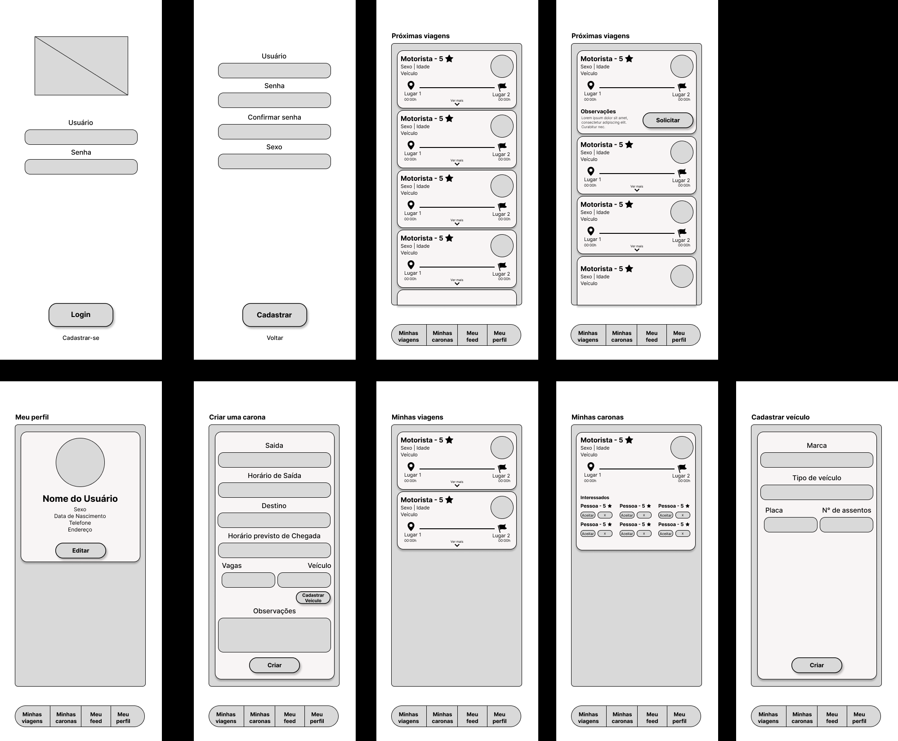
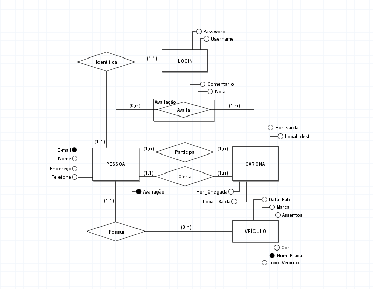
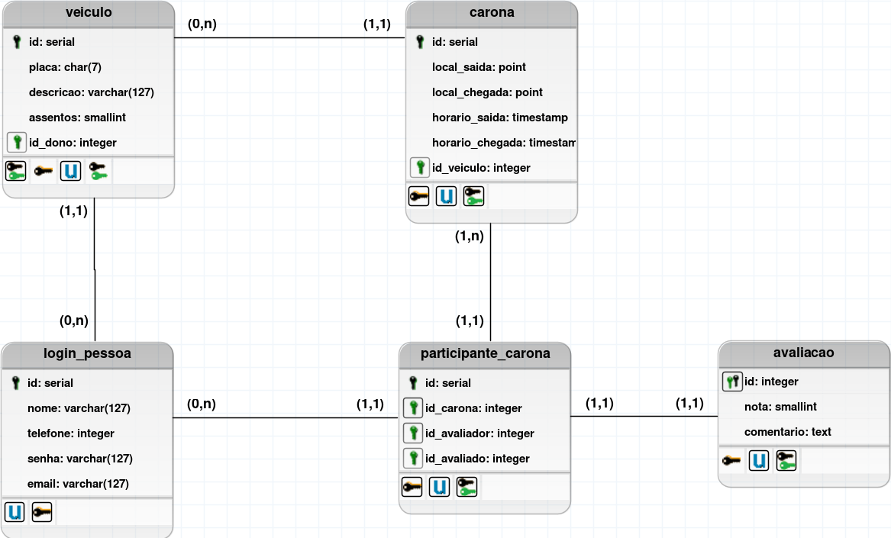
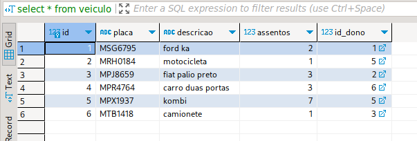
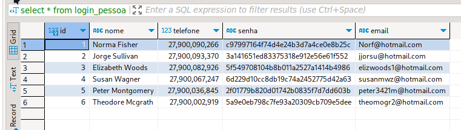
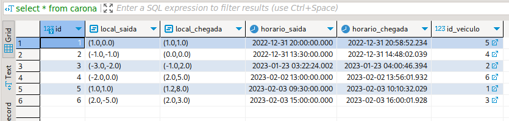
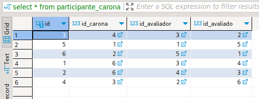
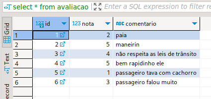

# TRABALHO 01:  PathFinder
Trabalho desenvolvido durante a disciplina de BD1

# Sumário

### 1. COMPONENTES<br>
Integrantes do grupo<br>
Eduardo Henrique Próspero Souza: duvrdx@gmail.com<br>
Lucas Vieira da Silva: lucasvieiradasilva07@gmail.com<br>
Mattheus Colares Gonçalves<br>
Victor Oliveira Santos<br>

### 2.INTRODUÇÃO E MOTIVAÇÃO<br>
Este documento contém a especificação do projeto do banco de dados <nome do projeto> 
<br>e motivação da escolha realizada. <br>

> A empresa "Devcom Projetos" visa colaborar com desenvolvimento de projetos para uma sociedade melhor. Sabendo-se dos desafios para gerenciar projetos dentro de uma empresa e visando unir as informações relativas a funcionários, departamentos e projetos em um mesmo local, ficamos motivados com o desenvolvimento deste sistema. O Sistema "Devcom" tem como objetivo gerenciar todas as informações ao desenvolvimento das atividades de projetos em diversas localidades do país. Para realizar suas operações adequadamente e empresa necessita que sistema que armazene informações relativas aos Projetos, Departamentos e Empregados, além de também armazenar dados sobre  Dependentes e Históricos de Salário dos empregados. O sistema deverá gerar um conjunto de relatórios que por sua vez atenderá os anseios da empresa em questão.
 

### 3.MINI-MUNDO<br>

> Essa plataforma conecta pessoas que oferecem caronas a pessoas que procuram caronas, proporcionando uma experiência de viagem flexível e personalizada. Você pode se cadastrar como um usuário do sistema, fornecendo informações básicas como nome, telefone, e-mail e criando um login seguro com senha e nome de usuário exclusivos. É possível compartilhar sua viagem diária para o trabalho com outras pessoas que seguem a mesma rota. Ou talvez você esteja planejando uma viagem de longa distância e queira dividir os custos e tornar a jornada mais agradável com companheiros de viagem conhecidos.

### 4.PROTOTIPAÇÃO, PERGUNTAS A SEREM RESPONDIDAS E TABELA DE DADOS<br>
#### 4.1 RASCUNHOS BÁSICOS DA INTERFACE (MOCKUPS)<br>
 


 
#### 4.2 QUAIS PERGUNTAS PODEM SER RESPONDIDAS COM O SISTEMA PROPOSTO?
   
> A Empresa PathFinder precisa inicialmente dos seguintes relatórios:
* Relatório que mostre o nome de cada usuario e o número de caronas que participou/ofertou
  
* Relatório relativo às avaliações feitas pelos usuários, bem como as informações da carona referida
  
* Relatorio que mostre para cada linha obtida o veículo, seu dono, número de vagas e placa
  
* Relatório que mostre as informações relacionadas a todos os usuários
  
* Relatório que obtenha a avalição média de cada usuário, e o número total de avaliações

 
 
#### 4.3 TABELA DE DADOS DO SISTEMA:
    a) Esta tabela deve conter todos os atributos do sistema e um mínimo de 10 linhas/registros de dados.
    b) Esta tabela tem a intenção de simular um relatório com todos os dados que serão armazenados 
    

    
    
### 5.MODELO CONCEITUAL<br>       
    
        
    
#### 5.1 Validação do Modelo Conceitual
    [Grupo01]: [Nomes dos que participaram na avaliação]
    [Grupo02]: [Nomes dos que participaram na avaliação]

#### 5.2 Descrição dos dados 
    [objeto]: [descrição do objeto]
    
    EXEMPLO:
    CLIENTE: Tabela que armazena as informações relativas ao cliente<br>
    CPF: campo que armazena o número de Cadastro de Pessoa Física para cada cliente da empresa.<br>


### 6	MODELO LÓGICO<br>
   

### 7	MODELO FÍSICO<br>
``` 
CREATE TABLE login_pessoa (
    id serial PRIMARY KEY,
    nome varchar(127),
    telefone bigint,
    senha varchar(127),
    email varchar(127) UNIQUE
);

CREATE TABLE veiculo (
    id serial PRIMARY KEY,
    placa char(7) UNIQUE,
    descricao varchar(127),
    assentos smallint,
    id_dono integer REFERENCES login_pessoa(id)
);

CREATE TABLE carona (
    id serial PRIMARY KEY,
    local_saida point,
    local_chegada point,
    horario_saida timestamp,
    horario_chegada timestamp,
    id_veiculo integer REFERENCES veiculo(id)
);

CREATE TABLE participante_carona (
    id serial PRIMARY KEY,
    id_carona integer REFERENCES carona(id),
    id_avaliador integer REFERENCES login_pessoa(id),
    id_avaliado integer REFERENCES login_pessoa(id)
);

CREATE TABLE avaliacao (
    id integer PRIMARY KEY REFERENCES participante_carona(id),
    nota smallint,
    comentario text
);
```        
       
### 8	INSERT APLICADO NAS TABELAS DO BANCO DE DADOS<br>
```
insert into login_pessoa (nome, telefone, senha, email)values
('Norma Fisher',27900090266,'c97997164f74d4e24b3d7a4ce0e8b25c','Norf@hotmail.com'),
('Jorge Sullivan',27900093370,'3a141651ed83375318e912e56e61f552','jjorsu@hotmail.com'),
('Elizabeth Woods',27900082926,'5f549708104b8b011a2527a1414b4986','elizwoods1@hotmail.com'),
('Susan Wagner',27900067247,'6d229d10cc8db19c74a2452775d42a63','susanmwz@hotmail.com'),
('Peter Montgomery',27900036845,'2f01779b820d01742b0835f7d7dd603b','peter3421m@hotmail.com'),
('Theodore Mcgrath',27900002919,'5a9e0eb798c7fe93a20309cb709e5dee','theomogr2@hotmail.com');

insert into veiculo (placa,descricao,assentos,id_dono)
values
('MSG6795','ford ka',2,1),
('MRH0184','motocicleta',1,5),
('MPJ8659','fiat palio preto',3,2),
('MPR4764','carro duas portas',3,6),
('MPX1937','kombi',7,5),
('MTB1418','camionete',1,3);

insert into carona (local_saida, local_chegada,horario_saida,horario_chegada,id_veiculo)
values
('(1.0, 0.0)', '(1.0, 1.0)','2022-12-31 20:00:00.00000','2022-12-31 20:58:52.23498',5),
('(-1.0, -1.0)','(0.0, 0.0)','2022-12-31 13:30:00.00000','2022-12-31 14:48:02.03921',4),
('(-3.0, -2.0)','(-1.0, 2.0)','2023-01-23 03:22:24.00212','2023-01-23 04:00:46.39412',2),
('(-2.0, 0.0)','(2.0, 5.0)','2023-02-02 13:00:00.00000','2023-02-02 13:56:01.93281',6),
('(1.0, 1.0)','(1.2, 8.0)','2023-02-03 09:30:00.00000','2023-02-03 10:10:32.02930',1),
('(2.0, -5.0)','(2.0, 3.0)','2023-02-03 15:00:00.00000','2023-02-03 16:00:01.92835',3);

insert into participante_carona (id_carona, id_avaliador, id_avaliado)
values
(6,6,4),
(6,4,6),
(4,3,2),
(3,2,3),
(1,1,5),
(2,5,1);

insert into avaliacao (id, comentario, nota)
values
(1,'paia',2),
(2,'maneirin',5),
(3,'não respeita as leis de trânsito',4),
(4,'bem rapidinho ele',5),
(5,'passageiro tava com cachorro',1),
(6,'passageiro falou muito',3)
```


### 9	TABELAS E PRINCIPAIS CONSULTAS<br>
#### 9.1	VEICULO <br>
 
#### 9.2	LOGIN_PESSOA <br>
 
#### 9.3	CARONA <br>
 
#### 9.4	PARTICIPANTE_CARONA <br>
 
#### 9.5	AVALIACAO <br>
 

># Marco de Entrega 01: Do item 1 até o item 9.1<br>

#### 9.2	CONSULTAS DAS TABELAS COM FILTROS WHERE (Mínimo 4)<br>
#### 9.3	CONSULTAS QUE USAM OPERADORES LÓGICOS, ARITMÉTICOS E TABELAS OU CAMPOS RENOMEADOS (Mínimo 11)
    a) Criar 5 consultas que envolvam os operadores lógicos AND, OR e Not
    b) Criar no mínimo 3 consultas com operadores aritméticos 
    c) Criar no mínimo 3 consultas com operação de renomear nomes de campos ou tabelas

#### 9.4	CONSULTAS QUE USAM OPERADORES LIKE E DATAS (Mínimo 12) <br>
    a) Criar outras 5 consultas que envolvam like ou ilike
    b) Criar uma consulta para cada tipo de função data apresentada.

#### 9.5	INSTRUÇÕES APLICANDO ATUALIZAÇÃO E EXCLUSÃO DE DADOS (Mínimo 6)<br>
    a) Criar minimo 3 de exclusão
    b) Criar minimo 3 de atualização

#### 9.6	CONSULTAS COM INNER JOIN E ORDER BY (Mínimo 6)<br>
    a) Uma junção que envolva todas as tabelas possuindo no mínimo 2 registros no resultado
    b) Outras junções que o grupo considere como sendo as de principal importância para o trabalho

#### 9.7	CONSULTAS COM GROUP BY E FUNÇÕES DE AGRUPAMENTO (Mínimo 6)<br>
    a) Criar minimo 2 envolvendo algum tipo de junção

#### 9.8	CONSULTAS COM LEFT, RIGHT E FULL JOIN (Mínimo 4)<br>
    a) Criar minimo 1 de cada tipo

#### 9.9	CONSULTAS COM SELF JOIN E VIEW (Mínimo 6)<br>
        a) Uma junção que envolva Self Join (caso não ocorra na base justificar e substituir por uma view)
        b) Outras junções com views que o grupo considere como sendo de relevante importância para o trabalho

#### 9.10	SUBCONSULTAS (Mínimo 4)<br>
     a) Criar minimo 1 envolvendo GROUP BY
     b) Criar minimo 1 envolvendo algum tipo de junção

># Marco de Entrega 02: Do item 9.2 até o ítem 9.10<br>

### 10 RELATÓRIOS E GRÁFICOS

#### a) análises e resultados provenientes do banco de dados desenvolvido (usar modelo disponível)
#### b) link com exemplo de relatórios será disponiblizado pelo professor no AVA
#### OBS: Esta é uma atividade de grande relevância no contexto do trabalho. Mantenha o foco nos 5 principais relatórios/resultados visando obter o melhor resultado possível.

    

### 11	AJUSTES DA DOCUMENTAÇÃO, CRIAÇÃO DOS SLIDES E VÍDEO PARA APRESENTAÇAO FINAL <br>

#### a) Modelo (pecha kucha)<br>
#### b) Tempo de apresentação 6:40 

># Marco de Entrega 03: Itens 10 e 11<br>
<br>
<br>


### 12 FORMATACAO NO GIT:<br> 
https://help.github.com/articles/basic-writing-and-formatting-syntax/
<comentario no git>
    
##### About Formatting
    https://help.github.com/articles/about-writing-and-formatting-on-github/
    
##### Basic Formatting in Git
    
    https://help.github.com/articles/basic-writing-and-formatting-syntax/#referencing-issues-and-pull-requests
    
    
##### Working with advanced formatting
    https://help.github.com/articles/working-with-advanced-formatting/
#### Mastering Markdown
    https://guides.github.com/features/mastering-markdown/

    
### OBSERVAÇÕES IMPORTANTES

#### Todos os arquivos que fazem parte do projeto (Imagens, pdfs, arquivos fonte, etc..), devem estar presentes no GIT. Os arquivos do projeto vigente não devem ser armazenados em quaisquer outras plataformas.
1. <strong>Caso existam arquivos com conteúdos sigilosos<strong>, comunicar o professor que definirá em conjunto com o grupo a melhor forma de armazenamento do arquivo.

#### Todos os grupos deverão fazer Fork deste repositório e dar permissões administrativas ao usuário do git "profmoisesomena", para acompanhamento do trabalho.

#### Os usuários criados no GIT devem possuir o nome de identificação do aluno (não serão aceitos nomes como Eu123, meuprojeto, pro456, etc). Em caso de dúvida comunicar o professor.


Link para BrModelo:<br>
http://www.sis4.com/brModelo/download.html
<br>


Link para curso de GIT<br>


